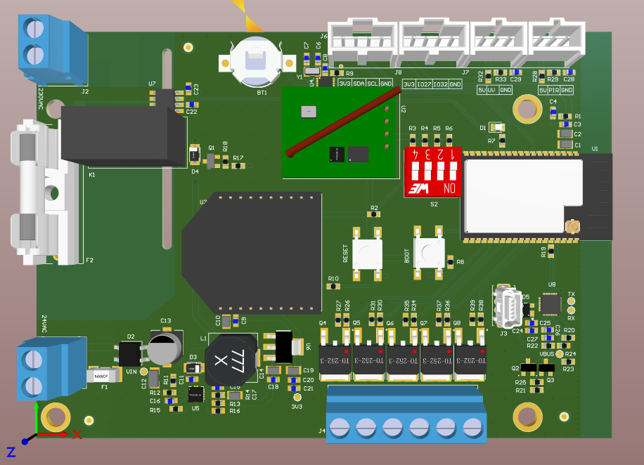
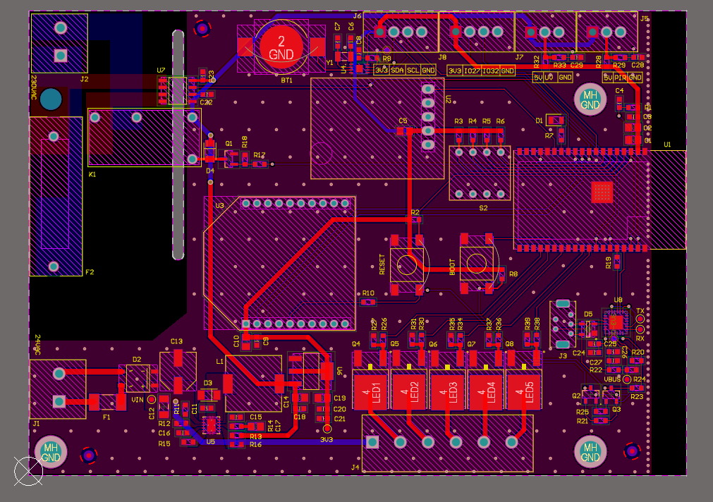

# ESP32 Mains Relay Switch PCB 

## Overview

This project involves the design and development of a custom PCB that integrates an ESP32 microcontroller with a mains-rated relay to enable wireless control (via Wi-Fi or Bluetooth) of AC appliances. The board is intended for home automation, industrial I/O control, or smart energy applications where safe, remote switching of high-voltage loads is required.

